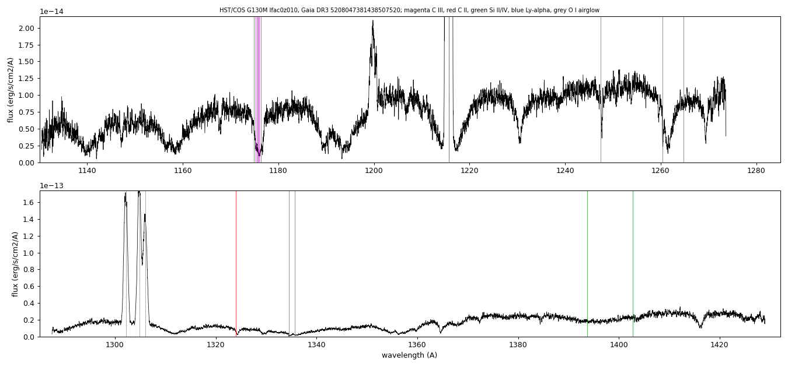
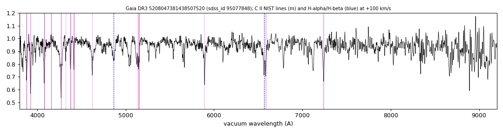

# GALEX J073504.2-794409 (Gaia DR3 5208047381438507520)

## Carbon lines

White dwarf, G = 16.564; catalogued: SIMBAD WD*/DA; MWDD DA.

**Measurement.** Carbon lines in the SDSS-V spectra: CCF contrast C II 16.7, C I 3.4 (velocities 100.0/130.0 km/s); C II/C III also in HST/COS.

Method and context: [carbon](../carbon.md)

Tables: [carbon_white_dwarfs.csv](../../tables/carbon_white_dwarfs.csv), [carbon_5208047381438507520_optical_CII_features.csv](../../tables/carbon_5208047381438507520_optical_CII_features.csv), [carbon_5208047381438507520_cos_features.csv](../../tables/carbon_5208047381438507520_cos_features.csv). Scripts: `scripts/carbon_lines.py` (commands in the [reproduction list](../../README.md#reproduction)).

## Figures

