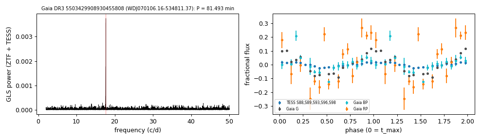

# WDJ070106.16-534811.37 (Gaia DR3 5503429908930455808)

## Short-period white dwarfs with irradiated companions

Low-mass white dwarf: GF21 H-atmosphere Teff 16240 K, 0.256 Msun; G = 18.426, 602 pc.

**Measurement.** P = 81.493 min; red-to-blue semi-amplitude ratio 2.1; W1 2.21x the white-dwarf model (companion M_W1 = 9.82).

Method and context: [irradiated_companions](../irradiated_companions.md)

Tables: [irradiated_companions.csv](../../tables/irradiated_companions.csv), [irradiated_companions_periods.csv](../../tables/irradiated_companions_periods.csv). Scripts: `scripts/irradiated_companions.py` (commands in the [reproduction list](../../README.md#reproduction)).

## Input data

- [data/gaia_dr3_epoch_photometry_5503429908930455808.csv](../../data/gaia_dr3_epoch_photometry_5503429908930455808.csv)

## Figures

