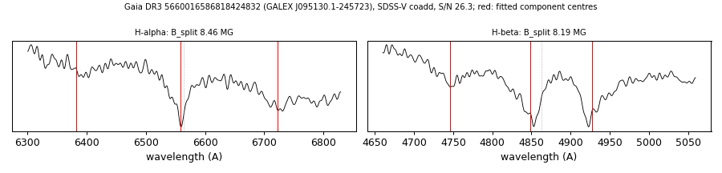

# GALEX J095130.1-245723 (Gaia DR3 5660016586818424832)

## Zeeman splitting

DA white dwarf, G = 17.165; catalogued: SnowWhite DAH/DA; SIMBAD WD*/DA; MWDD DA.

**Measurement.** Zeeman-split Balmer lines: B = 8.46 ± 0.07 MG (H-alpha), 8.19 ± 0.05 MG (H-beta); spectrum S/N 26.3.

Method and context: [zeeman](../zeeman.md)

Tables: [magnetic_zeeman.csv](../../tables/magnetic_zeeman.csv). Scripts: `scripts/zeeman_split.py` (commands in the [reproduction list](../../README.md#reproduction)).

## Figures

