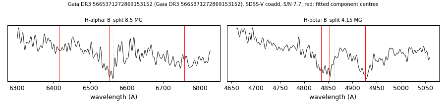

# Gaia DR3 5665371272869153152

## Zeeman splitting

DA white dwarf, G = 19.297; catalogued: SnowWhite DA; SIMBAD WD?.

**Measurement.** Zeeman-split Balmer lines: B = 8.5 ± 0.3 MG (H-alpha), 4.15 ± 0.08 MG (H-beta); spectrum S/N 7.7; the two lines disagree by more than 1 MG, so the field is not established.

Method and context: [zeeman](../zeeman.md)

Tables: [magnetic_zeeman.csv](../../tables/magnetic_zeeman.csv). Scripts: `scripts/zeeman_split.py` (commands in the [reproduction list](../../README.md#reproduction)).

## Figures

