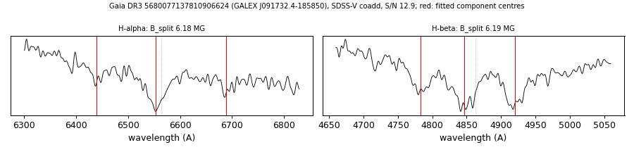

# GALEX J091732.4-185850 (Gaia DR3 5680077137810906624)

## Zeeman splitting

DA white dwarf, G = 17.615; catalogued: SnowWhite DAH; SIMBAD WD*/DA; MWDD DA:.

**Measurement.** Zeeman-split Balmer lines: B = 6.18 ± 0.04 MG (H-alpha), 6.19 ± 0.04 MG (H-beta); spectrum S/N 12.9.

Method and context: [zeeman](../zeeman.md)

Tables: [magnetic_zeeman.csv](../../tables/magnetic_zeeman.csv). Scripts: `scripts/zeeman_split.py` (commands in the [reproduction list](../../README.md#reproduction)).

## Figures

