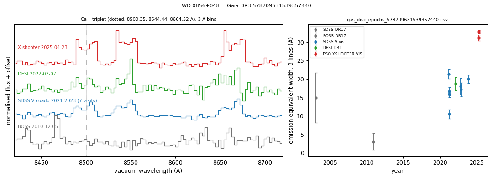
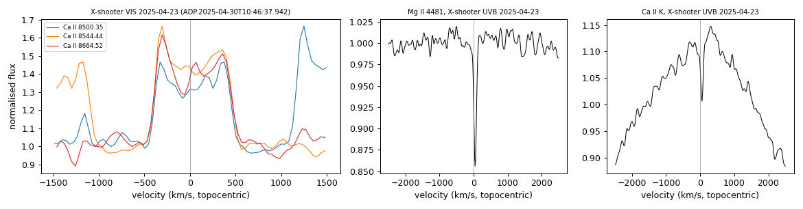

# WD 0856+048 (Gaia DR3 578709631539357440)

## Ca II triplet emission (gaseous discs)

White dwarf, G = 18.341; catalogued: SnowWhite DA; SIMBAD WD*/DA; MWDD DA; DESI DR1 DA.

**Measurement.** Ca II triplet emission (double-peaked, peak velocities -310/360 km/s); EW 17.55 ± 0.45 A in the SDSS-V coadd; other spectra: SDSS 2003-01-31, BOSS 2010-12-05, DESI 2022-03-07, X-shooter 2025-04-23 (2 spectra); gas_disc_epochs_578709631539357440.csv.

Method and context: [gas_discs](../gas_discs.md)

Tables: [gas_disc_white_dwarfs.csv](../../tables/gas_disc_white_dwarfs.csv), [gas_disc_epochs_578709631539357440.csv](../../tables/gas_disc_epochs_578709631539357440.csv). Scripts: `scripts/gas_disc_epochs.py` (commands in the [reproduction list](../../README.md#reproduction)).

## Input data

- [data/ztf_578709631539357440.csv](../../data/ztf_578709631539357440.csv)

## Figures

