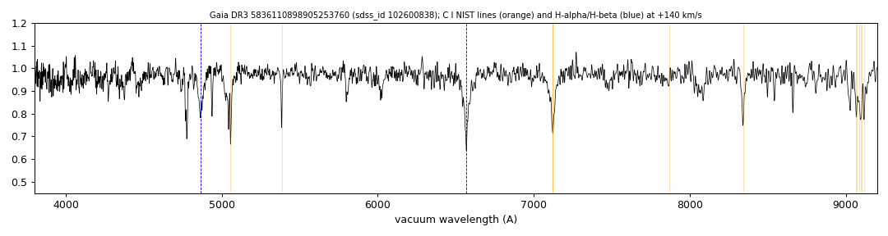

# Gaia DR3 5836110898905253760

## Carbon lines

White dwarf, G = 17.441; catalogued: SIMBAD PM*.

**Measurement.** Carbon lines in the SDSS-V spectra: CCF contrast C II 7.5, C I 8.6 (velocities -770.0/140.0 km/s).

Method and context: [carbon](../carbon.md)

Tables: [carbon_white_dwarfs.csv](../../tables/carbon_white_dwarfs.csv). Scripts: `scripts/carbon_lines.py` (commands in the [reproduction list](../../README.md#reproduction)).

## Figures

