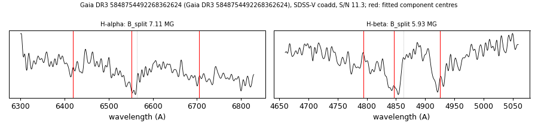

# Gaia DR3 5848754492268362624

## Zeeman splitting

DA white dwarf, G = 17.888; catalogued: SnowWhite DAH/DA; SIMBAD WD*/DA; MWDD DA:.

**Measurement.** Zeeman-split Balmer lines: B = 7.11 ± 0.13 MG (H-alpha), 5.93 ± 0.21 MG (H-beta); spectrum S/N 11.3; the two lines disagree by more than 1 MG, so the field is not established.

Method and context: [zeeman](../zeeman.md)

Tables: [magnetic_zeeman.csv](../../tables/magnetic_zeeman.csv). Scripts: `scripts/zeeman_split.py` (commands in the [reproduction list](../../README.md#reproduction)).

## Figures

