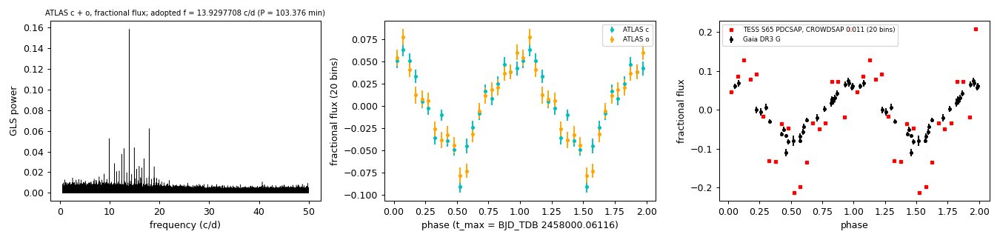
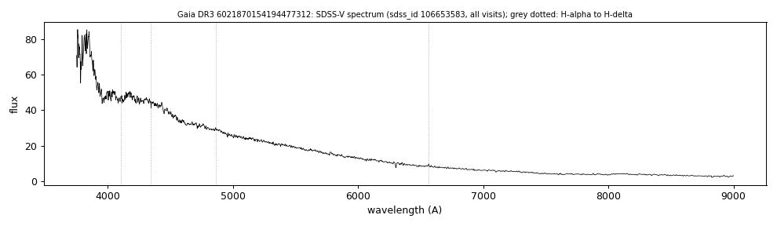

# Gaia DR3 6021870154194477312

## Photometric periods

White dwarf with a 103.4-min period; three Gaia sources within 13 arcsec are fitted separately. Gaia DR3 lists the same frequency in its spurious-signal table (Holl et al. 2023); VSX lists type WD without a period.

**Measurement.** 103.4-min period in ATLAS, Gaia DR3 epoch photometry and TESS (frequency, amplitudes and times of maximum per data set in the table)..

Method and context: [periodic](../periodic.md)

Tables: [periodic_6021870154194477312.csv](../../tables/periodic_6021870154194477312.csv). Scripts: `scripts/periodic_6021870154194477312.py`, `scripts/tess_periodogram.py 1251484163 65 120 0.5 50` (commands in the [reproduction list](../../README.md#reproduction)).

## Input data

- [data/atlas_forced_photometry_6021870154194477312.txt](../../data/atlas_forced_photometry_6021870154194477312.txt)
- [data/gaia_dr3_epoch_photometry_6021870154194477312.csv](../../data/gaia_dr3_epoch_photometry_6021870154194477312.csv)
- [data/periodic_6021870154194477312_sources.csv](../../data/periodic_6021870154194477312_sources.csv)

## Figures

