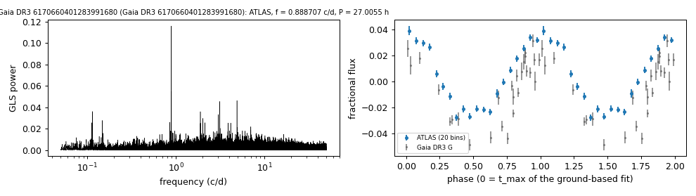

# Gaia DR3 6170660401283991680

## Photometric periods

Gaia XP class DO (Vincent et al. 2024).

**Measurement.** P = 27.00552 ± 0.00021 h (ATLAS, n = 4089, BJD 2457407.127-2461296.524); semi-amplitude 3.2% ± 0.1%.

| data set | n | semi-amplitude | first harmonic |
|---|---|---|---|
| ATLAS | 4089 | 3.17% ± 0.14% | 0.21% |
| Gaia DR3 epoch photometry G | 27 | 3.75% ± 0.33% | - |

Method and context: [periodic](../periodic.md)

Tables: [periodic_white_dwarfs.csv](../../tables/periodic_white_dwarfs.csv). Scripts: `scripts/periodic_white_dwarfs.py` (commands in the [reproduction list](../../README.md#reproduction)).

## Input data

- [data/atlas_forced_photometry_6170660401283991680.txt](../../data/atlas_forced_photometry_6170660401283991680.txt)
- [data/gaia_dr3_epoch_photometry_6170660401283991680.csv](../../data/gaia_dr3_epoch_photometry_6170660401283991680.csv)

## Figures

