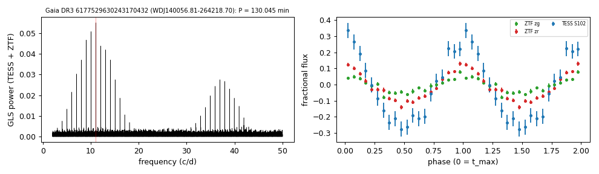

# WDJ140056.81-264218.70 (Gaia DR3 6177529630243170432)

## Short-period white dwarfs with irradiated companions

Low-mass white dwarf: GF21 H-atmosphere Teff 36036 K, 0.411 Msun; G = 18.301, 898 pc.

**Measurement.** P = 130.045 min; red-to-blue (Gaia RP/BP) semi-amplitude ratio 2.06; W1 2.75x the white-dwarf model (companion M_W1 = 8.97).

Method and context: [irradiated_companions](../irradiated_companions.md)

Tables: [irradiated_companions.csv](../../tables/irradiated_companions.csv), [irradiated_companions_periods.csv](../../tables/irradiated_companions_periods.csv). Scripts: `scripts/irradiated_companions.py` (commands in the [reproduction list](../../README.md#reproduction)).

## Input data

- [data/ztf_6177529630243170432.csv](../../data/ztf_6177529630243170432.csv)

## Figures

