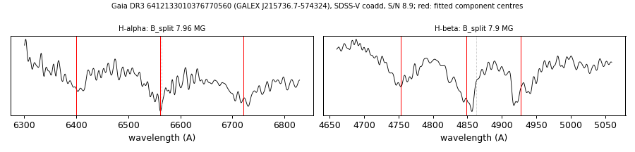

# GALEX J215736.7-574324 (Gaia DR3 6412133010376770560)

## Zeeman splitting

DA white dwarf, G = 18.645; catalogued: SnowWhite DAH; SIMBAD WD*/DA; MWDD DA.

**Measurement.** Zeeman-split Balmer lines: B = 7.96 ± 0.05 MG (H-alpha), 7.9 ± 0.05 MG (H-beta); spectrum S/N 8.9.

Method and context: [zeeman](../zeeman.md)

Tables: [magnetic_zeeman.csv](../../tables/magnetic_zeeman.csv). Scripts: `scripts/zeeman_split.py` (commands in the [reproduction list](../../README.md#reproduction)).

## Figures

