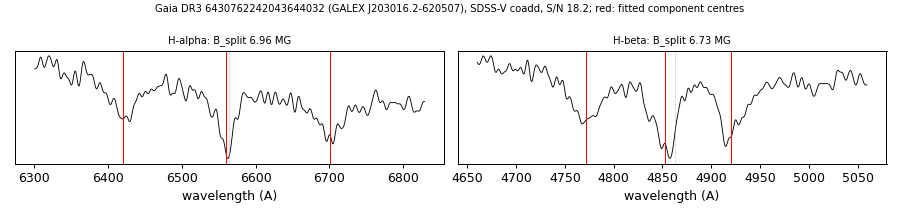

# GALEX J203016.2-620507 (Gaia DR3 6430762242043644032)

## Zeeman splitting

DA white dwarf, G = 18.771; catalogued: SnowWhite DAH/DA; SIMBAD WD*/DA; MWDD DA.

**Measurement.** Zeeman-split Balmer lines: B = 6.96 ± 0.03 MG (H-alpha), 6.73 ± 0.03 MG (H-beta); spectrum S/N 18.2.

Method and context: [zeeman](../zeeman.md)

Tables: [magnetic_zeeman.csv](../../tables/magnetic_zeeman.csv). Scripts: `scripts/zeeman_split.py` (commands in the [reproduction list](../../README.md#reproduction)).

## Figures

