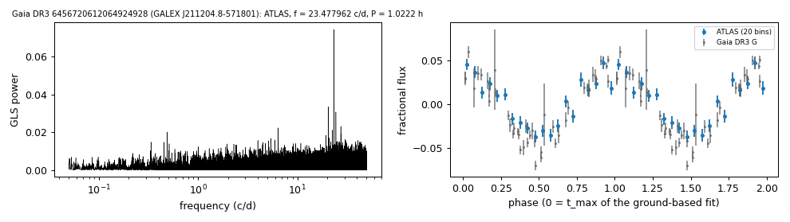

# GALEX J211204.8-571801 (Gaia DR3 6456720612064924928)

## Photometric periods

White dwarf selected by its Gaia DR3 GLS frequency (GALEX J211204.8-571801).

**Measurement.** P = 1.02224 ± 0.0 h (ATLAS, n = 1899, BJD 2459644.879-2461306.699); semi-amplitude 3.5% ± 0.3%.

| data set | n | semi-amplitude | first harmonic |
|---|---|---|---|
| ATLAS | 1899 | 3.48% ± 0.29% | 0.37% |
| Gaia DR3 epoch photometry G | 44 | 4.83% ± 0.22% | - |

Method and context: [periodic](../periodic.md)

Tables: [periodic_white_dwarfs.csv](../../tables/periodic_white_dwarfs.csv). Scripts: `scripts/periodic_white_dwarfs.py` (commands in the [reproduction list](../../README.md#reproduction)).

## Input data

- [data/atlas_forced_photometry_6456720612064924928.txt](../../data/atlas_forced_photometry_6456720612064924928.txt)
- [data/gaia_dr3_epoch_photometry_6456720612064924928.csv](../../data/gaia_dr3_epoch_photometry_6456720612064924928.csv)

## Figures

