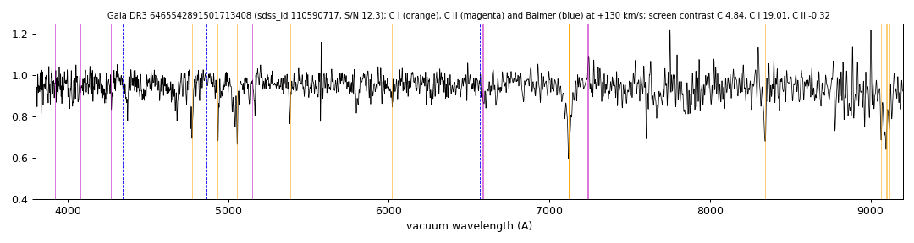

# GALEX J213644.9-515758 (Gaia DR3 6465542891501713408)

## Carbon lines

White dwarf, G = 18.644; catalogued: SIMBAD WD*/DC:; MWDD DC:.

**Measurement.** Carbon lines in the SDSS-V spectra: CCF contrast C II 1.6, C I 10.5 (velocities 820.0/120.0 km/s).

Method and context: [carbon](../carbon.md)

Tables: [carbon_white_dwarfs.csv](../../tables/carbon_white_dwarfs.csv). Scripts: `scripts/carbon_lines.py` (commands in the [reproduction list](../../README.md#reproduction)).

## Figures

