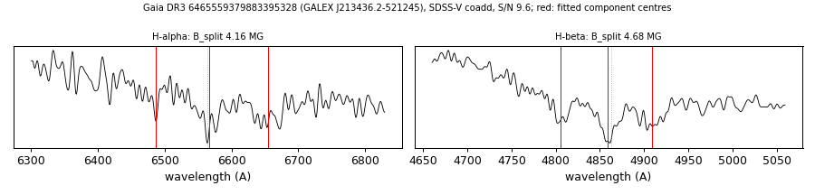

# GALEX J213436.2-521245 (Gaia DR3 6465559379883395328)

## Zeeman splitting

DA white dwarf, G = 19.088; catalogued: SnowWhite DA; SIMBAD WD*/DA; MWDD DA.

**Measurement.** Zeeman-split Balmer lines: B = 4.16 ± 0.06 MG (H-alpha), 4.68 ± 0.05 MG (H-beta); spectrum S/N 9.6.

Method and context: [zeeman](../zeeman.md)

Tables: [magnetic_zeeman.csv](../../tables/magnetic_zeeman.csv). Scripts: `scripts/zeeman_split.py` (commands in the [reproduction list](../../README.md#reproduction)).

## Figures

