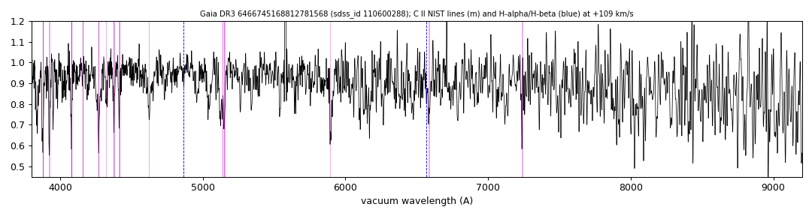

# GALEX J212643.1-494857 (Gaia DR3 6466745168812781568)

## Carbon lines

White dwarf, G = 19.438; catalogued: SIMBAD WD?.

**Measurement.** Carbon lines in the SDSS-V spectra: CCF contrast C II 15.0, C I 2.6 (velocities 80.0/770.0 km/s).

Method and context: [carbon](../carbon.md)

Tables: [carbon_white_dwarfs.csv](../../tables/carbon_white_dwarfs.csv). Scripts: `scripts/carbon_lines.py` (commands in the [reproduction list](../../README.md#reproduction)).

## Figures

