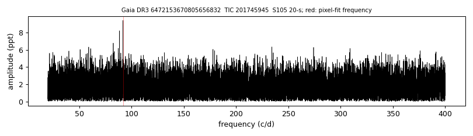
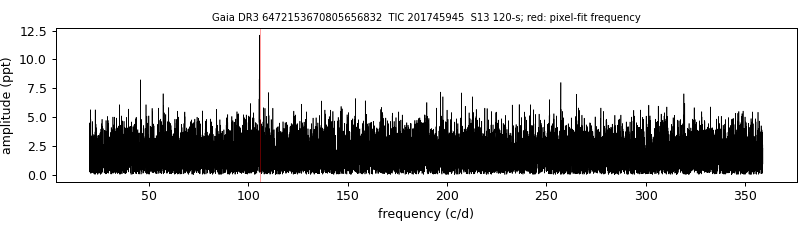

# L  210-25 (Gaia DR3 6472153670805656832)

## TESS amplitude spectra

White dwarf, G = 16.402; SnowWhite DA (Teff 11191 K, log g 8.16); catalogued: SIMBAD WD*/DA; MWDD DA.

**Measurement.** TESS pulsation signal(s): sector 13: 817.3 s at 12.1 ppt (FAP 3e-07); sector 27: 963.8 s at 7.8 ppt (FAP 0.16); sector 67: 592.0 s at 8.0 ppt (FAP 0.89); sector 67: 592.0 s at 8.2 ppt (FAP 0.12); sector 94: 922.1 s at 7.8 ppt (FAP 0.029); sector 101: 878.6 s at 8.2 ppt (FAP 0.19); sector 101: 878.5 s at 8.6 ppt (FAP 0.029); sector 104: 736.0 s at 6.6 ppt (FAP 0.052); sector 104: 932.6 s at 6.1 ppt (FAP 0.14); sector 105: 940.9 s at 9.4 ppt (FAP 0.0012); sector 105: 940.4 s at 8.6 ppt (FAP 0.025); pixel-level test (sector 13): chi2 40.7 at the target vs 52.4 at the best other star (G = 18.39, 19.2 arcsec); pixel-level test (sector 105): chi2 37.8 at the target vs 50.0 at the best other star (G = 18.39, 20.3 arcsec).

Method and context: [zz_ceti](../zz_ceti.md)

Tables: [zz_ceti_objects.csv](../../tables/zz_ceti_objects.csv), [zz_ceti_tess_sectors.csv](../../tables/zz_ceti_tess_sectors.csv). Scripts: `scripts/tess_periodogram.py`, `scripts/tess_pixel_test.py` (commands in the [reproduction list](../../README.md#reproduction)).

## Figures

