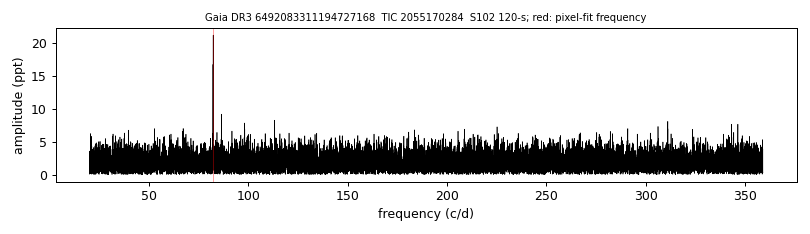
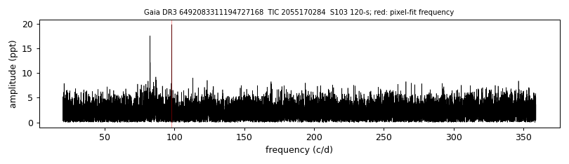

# [OHD2001] WD J2324-595 (Gaia DR3 6492083311194727168)

## TESS amplitude spectra

White dwarf, G = 16.809; SnowWhite DA (Teff 11600 K, log g 7.89); catalogued: SIMBAD WD*/DA; MWDD DA.

**Measurement.** TESS pulsation signal(s): sector 95: 170.4 s at 11.7 ppt (FAP 0.57); sector 95: 326.6 s at 10.9 ppt (FAP 0.44); sector 102: 1049.3 s at 21.2 ppt (FAP 1.5e-27); sector 103: 881.6 s at 19.8 ppt (FAP 2.1e-17); sector 104: 882.4 s at 15.3 ppt (FAP 4.7e-11); sector 105: 999.3 s at 9.2 ppt (FAP 0.063); pixel-level test (sector 102): chi2 25.3 at the target vs 92.9 at the best other star (G = 14.52, 33.4 arcsec); pixel-level test (sector 103): chi2 46.0 at the target vs 119.0 at the best other star (G = 14.52, 35.5 arcsec).

Method and context: [zz_ceti](../zz_ceti.md)

Tables: [zz_ceti_objects.csv](../../tables/zz_ceti_objects.csv), [zz_ceti_tess_sectors.csv](../../tables/zz_ceti_tess_sectors.csv). Scripts: `scripts/tess_periodogram.py`, `scripts/tess_pixel_test.py` (commands in the [reproduction list](../../README.md#reproduction)).

## Figures

