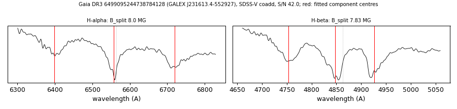

# GALEX J231613.4-552927 (Gaia DR3 6499095244738784128)

## Zeeman splitting

DA white dwarf, G = 16.701; catalogued: SnowWhite DAH; SIMBAD WD*/DA; MWDD DA. Common proper motion with HD 219458 at 164 arcsec.

**Measurement.** Zeeman-split Balmer lines: B = 8.0 ± 0.02 MG (H-alpha), 7.83 ± 0.03 MG (H-beta); spectrum S/N 42.0.

Method and context: [zeeman](../zeeman.md)

Tables: [magnetic_zeeman.csv](../../tables/magnetic_zeeman.csv). Scripts: `scripts/zeeman_split.py` (commands in the [reproduction list](../../README.md#reproduction)).

## Figures

