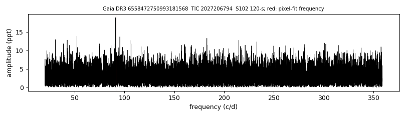
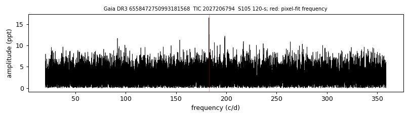

# GALEX J214927.5-515827 (Gaia DR3 6558472750993181568)

## TESS amplitude spectra

White dwarf, G = 17.084; SnowWhite DA (Teff 11817 K, log g 8.12); catalogued: SIMBAD WD*/DA; MWDD DA.

**Measurement.** TESS pulsation signal(s): sector 27: 1067.1 s at 14.3 ppt (FAP 0.22); sector 28: 472.5 s at 11.2 ppt (FAP 0.082); sector 68: 472.7 s at 13.9 ppt (FAP 0.00046); sector 68: 472.7 s at 13.7 ppt (FAP 0.00015); sector 95: 472.6 s at 14.8 ppt (FAP 0.0023); sector 95: 472.7 s at 11.6 ppt (FAP 0.32); sector 102: 947.5 s at 18.9 ppt (FAP 0.00011); sector 102: 947.5 s at 19.0 ppt (FAP 3.3e-05); sector 104: 472.6 s at 27.0 ppt (FAP 0.1); sector 104: 269.3 s at 24.8 ppt (FAP 0.16); sector 105: 472.6 s at 16.5 ppt (FAP 0.00071); sector 105: 472.6 s at 16.5 ppt (FAP 4.1e-05); pixel-level test (sector 102): chi2 37.4 at the target vs 95.7 at the best other star (G = 17.88, 35.6 arcsec); pixel-level test (sector 105): chi2 64.1 at the target vs 123.1 at the best other star (G = 17.88, 36.2 arcsec).

Method and context: [zz_ceti](../zz_ceti.md)

Tables: [zz_ceti_objects.csv](../../tables/zz_ceti_objects.csv), [zz_ceti_tess_sectors.csv](../../tables/zz_ceti_tess_sectors.csv). Scripts: `scripts/tess_periodogram.py`, `scripts/tess_pixel_test.py` (commands in the [reproduction list](../../README.md#reproduction)).

## Figures

