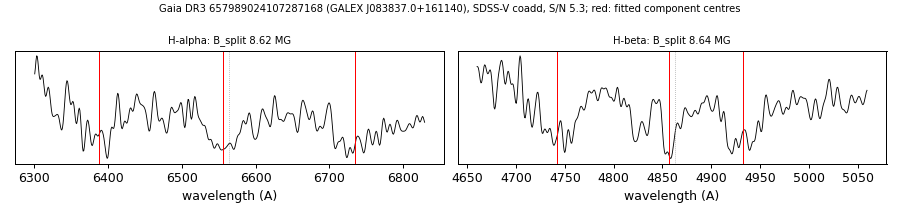

# GALEX J083837.0+161140 (Gaia DR3 657989024107287168)

## Zeeman splitting

DA white dwarf, G = 19.111; catalogued: SnowWhite DA/DAH; SIMBAD WD?.

**Measurement.** Zeeman-split Balmer lines: B = 8.62 ± 0.07 MG (H-alpha), 8.64 ± 0.06 MG (H-beta); spectrum S/N 5.3.

Method and context: [zeeman](../zeeman.md)

Tables: [magnetic_zeeman.csv](../../tables/magnetic_zeeman.csv). Scripts: `scripts/zeeman_split.py` (commands in the [reproduction list](../../README.md#reproduction)).

## Figures

