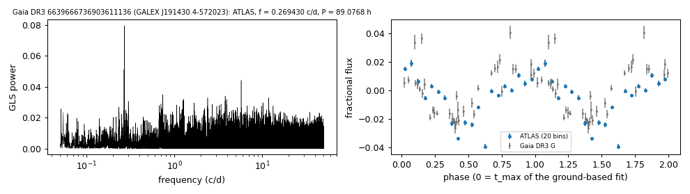

# GALEX J191430.4-572023 (Gaia DR3 6639666736903611136)

## Photometric periods

White dwarf selected by its Gaia DR3 GLS frequency (GALEX J191430.4-572023).

**Measurement.** P = 89.07682 ± 0.00637 h (ATLAS, n = 2113, BJD 2459618.613-2461306.643); semi-amplitude 1.8% ± 0.1%.

| data set | n | semi-amplitude | first harmonic |
|---|---|---|---|
| ATLAS | 2113 | 1.85% ± 0.14% | 0.34% |
| Gaia DR3 epoch photometry G | 38 | 2.12% ± 0.20% | - |
| TESS S27 PDCSAP (TIC 201655627, CROWDSAP 0.327) | 16094 | 2.10% ± 0.16% | - |
| TESS S67 PDCSAP (TIC 201655627, CROWDSAP 0.243) | 14093 | 1.47% ± 0.16% | - |
| TESS S94 PDCSAP (TIC 201655627, CROWDSAP 0.208) | 15112 | 1.27% ± 0.14% | - |
| TESS S103 PDCSAP (TIC 201655627, CROWDSAP 0.143) | 15256 | 2.72% ± 0.26% | - |
| TESS S104 PDCSAP (TIC 201655627, CROWDSAP 0.225) | 15610 | 1.75% ± 0.16% | - |

Method and context: [periodic](../periodic.md)

Tables: [periodic_white_dwarfs.csv](../../tables/periodic_white_dwarfs.csv). Scripts: `scripts/periodic_white_dwarfs.py` (commands in the [reproduction list](../../README.md#reproduction)).

## Input data

- [data/atlas_forced_photometry_6639666736903611136.txt](../../data/atlas_forced_photometry_6639666736903611136.txt)
- [data/gaia_dr3_epoch_photometry_6639666736903611136.csv](../../data/gaia_dr3_epoch_photometry_6639666736903611136.csv)

## Figures

