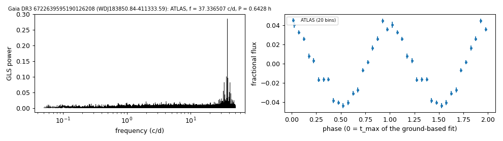

# WDJ183850.84-411333.59 (Gaia DR3 6722639595190126208)

## Photometric periods

Hot massive DA white dwarf (GF21 H-atmosphere 36.0 kK, 1.20 Msun; Gaia XP fit in the MWDD 63.7 kK, 1.30 Msun), G = 16.79, 120 pc; the period was found in TESS 2-min light curves (sectors 93 and 104) and recovered in ATLAS.

**Measurement.** P = 0.6428 ± 0.0 h (ATLAS, n = 2823, BJD 2457922.997-2461310.527); semi-amplitude 4.0% ± 0.1%.

| data set | n | semi-amplitude | first harmonic |
|---|---|---|---|
| ATLAS | 2823 | 4.04% ± 0.12% | 0.42% |
| TESS S93 PDCSAP (TIC 1697348546, CROWDSAP 0.055) | 15828 | 15.63% ± 1.10% | - |
| TESS S104 PDCSAP (TIC 1697348546, CROWDSAP 0.084) | 16151 | 15.47% ± 1.01% | - |

Method and context: [periodic](../periodic.md)

Tables: [periodic_white_dwarfs.csv](../../tables/periodic_white_dwarfs.csv). Scripts: `scripts/periodic_white_dwarfs.py` (commands in the [reproduction list](../../README.md#reproduction)).

## Input data

- [data/atlas_forced_photometry_6722639595190126208.txt](../../data/atlas_forced_photometry_6722639595190126208.txt)

## Figures

