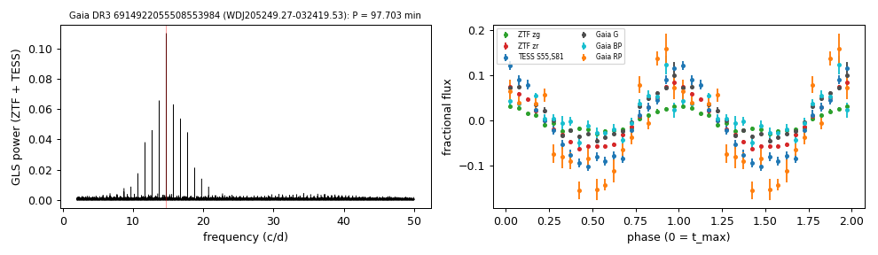
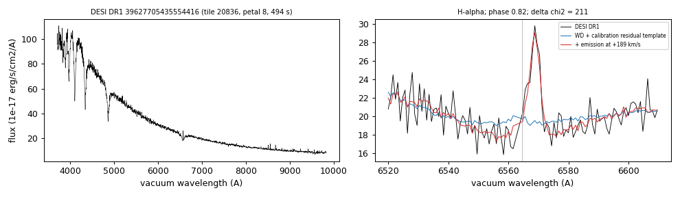

# WDJ205249.27-032419.53 (Gaia DR3 6914922055508553984)

## Short-period white dwarfs with irradiated companions

Low-mass white dwarf: GF21 H-atmosphere Teff 16231 K, 0.301 Msun; G = 17.466, 334 pc.

**Measurement.** P = 97.703 min; red-to-blue semi-amplitude ratio 2.45; W1 3.74x the white-dwarf model (companion M_W1 = 9.25).

Method and context: [irradiated_companions](../irradiated_companions.md)

Tables: [irradiated_companions.csv](../../tables/irradiated_companions.csv), [irradiated_companions_periods.csv](../../tables/irradiated_companions_periods.csv). Scripts: `scripts/irradiated_companions.py` (commands in the [reproduction list](../../README.md#reproduction)).

## Input data

- [data/gaia_dr3_epoch_photometry_6914922055508553984.csv](../../data/gaia_dr3_epoch_photometry_6914922055508553984.csv)
- [data/ztf_6914922055508553984.csv](../../data/ztf_6914922055508553984.csv)

## Figures

