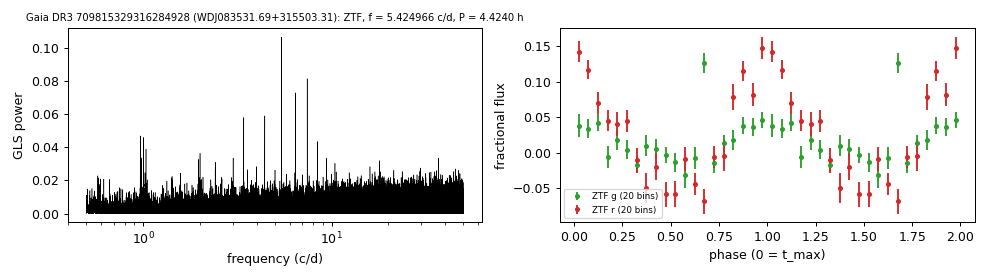

# WDJ083531.69+315503.31 (Gaia DR3 709815329316284928)

## Periods of DA white dwarfs with emission lines

DESI DR1 class DAE; GF21 13.2 kK, 0.25 Msun; W1, W2 excess 2.1, 2.4 mag. G = 19.26, 742 pc.

**Measurement.** P = 4.42399 ± 2e-05 h (ZTF, n = 1152, BJD 2458206.692-2460970.018); semi-amplitude 4.9% ± 0.4%.

| data set | n | semi-amplitude | first harmonic |
|---|---|---|---|
| ZTF | 1152 | 4.90% ± 0.42% | 0.61% |
| ZTF zg | 456 | 2.34% ± 0.59% | 0.56% |
| ZTF zr | 696 | 8.92% ± 0.60% | 1.70% |

Method and context: [dae_wd_periods](../dae_wd_periods.md)

Tables: [dae_wd_periods.csv](../../tables/dae_wd_periods.csv). Scripts: `scripts/hot_dae_wd_periods.py` (commands in the [reproduction list](../../README.md#reproduction)).

## Input data

- [data/ztf_709815329316284928.csv](../../data/ztf_709815329316284928.csv)

## Figures

