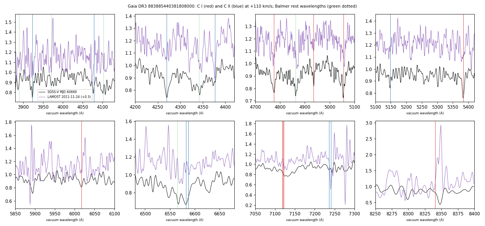
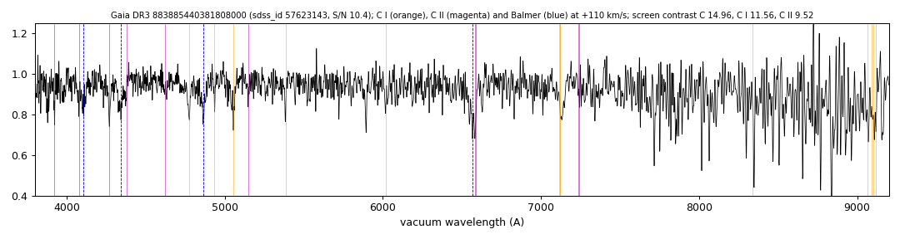

# Gaia DR3 883885440381808000

## Carbon lines

White dwarf, G = 18.654; catalogued: SIMBAD WD?.

**Measurement.** Carbon lines in the SDSS-V spectra: CCF contrast C II 7.8, C I 7.3 (velocities 70.0/240.0 km/s).

Method and context: [carbon](../carbon.md)

Tables: [carbon_white_dwarfs.csv](../../tables/carbon_white_dwarfs.csv). Scripts: `scripts/carbon_lines.py` (commands in the [reproduction list](../../README.md#reproduction)).

## Figures

