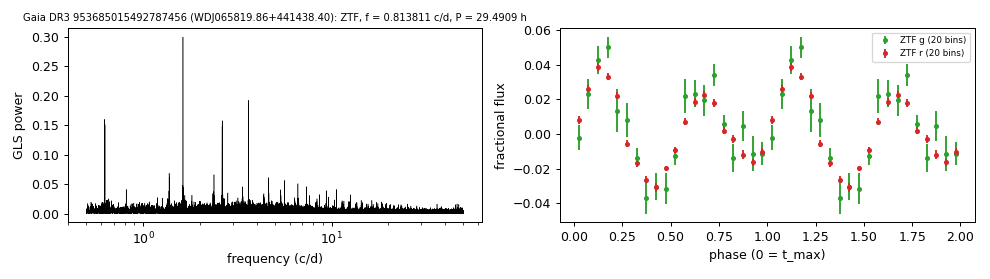

# WDJ065819.86+441438.40 (Gaia DR3 953685015492787456)

## Day-scale periods of hot white dwarfs

Gaia XP class DO (Vincent et al. 2024). G = 17.53, 483 pc.

**Measurement.** P = 29.49088 ± 0.00092 h (ZTF, n = 2586, BJD 2458214.632-2460968.955); semi-amplitude 0.9% ± 0.1%.

| data set | n | semi-amplitude | first harmonic |
|---|---|---|---|
| ZTF | 2586 | 0.92% ± 0.08% | 2.73% |
| ZTF zg | 111 | 0.98% ± 0.29% | 3.41% |
| ZTF zr | 2475 | 0.92% ± 0.09% | 2.69% |

Method and context: [hot_wd_periods](../hot_wd_periods.md)

Tables: [hot_wd_periods.csv](../../tables/hot_wd_periods.csv). Scripts: `scripts/hot_dae_wd_periods.py` (commands in the [reproduction list](../../README.md#reproduction)).

## Input data

- [data/ztf_953685015492787456.csv](../../data/ztf_953685015492787456.csv)

## Figures

