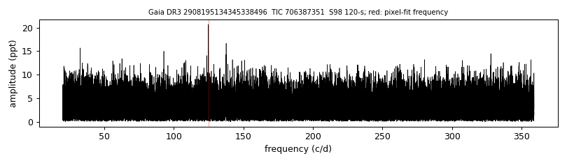
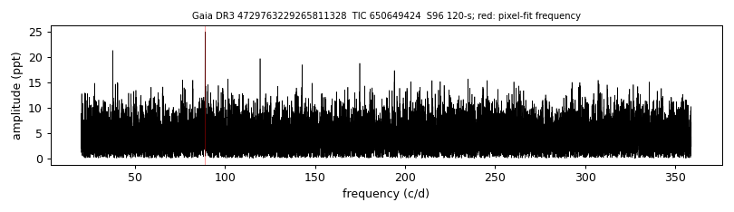
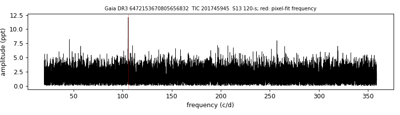
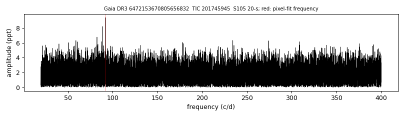
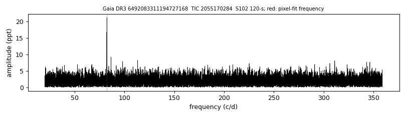
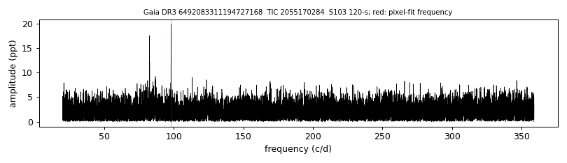
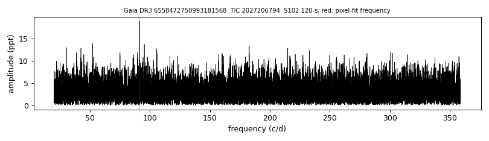
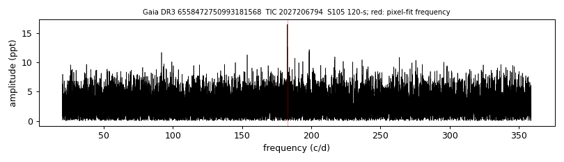

# TESS amplitude spectra

`tables/zz_ceti_objects.csv` and `tables/zz_ceti_tess_sectors.csv` give the highest TESS peak per light curve for five SDSS-V white dwarfs, with pixel-level fits to locate the signal (method in [METHODS.md](../METHODS.md#methods)). Each figure shows one sector; the red line is the frequency used in the pixel fit.

**Gaia DR3 2908195134345338496**, TIC 706387351, sector 98 (120-s): peak 124.845 c/d, 20.7 ppt, S/N 5.2

**Gaia DR3 4729763229265811328**, TIC 650649424, sector 96 (120-s): peak 88.945 c/d, 25.0 ppt, S/N 5.1

**Gaia DR3 6472153670805656832**, TIC 201745945, sector 13 (120-s): peak 105.712 c/d, 12.1 ppt, S/N 6.0

**Gaia DR3 6472153670805656832**, TIC 201745945, sector 105 (20-s): peak 91.83 c/d, 9.4 ppt, S/N 5.0

**Gaia DR3 6492083311194727168**, TIC 2055170284, sector 102 (120-s): peak 82.339 c/d, 21.2 ppt, S/N 9.7

**Gaia DR3 6492083311194727168**, TIC 2055170284, sector 103 (120-s): peak 98.0 c/d, 19.8 ppt, S/N 8.0

**Gaia DR3 6558472750993181568**, TIC 2027206794, sector 102 (120-s): peak 91.188 c/d, 19.0 ppt, S/N 5.2

**Gaia DR3 6558472750993181568**, TIC 2027206794, sector 105 (120-s): peak 182.821 c/d, 16.5 ppt, S/N 5.1

